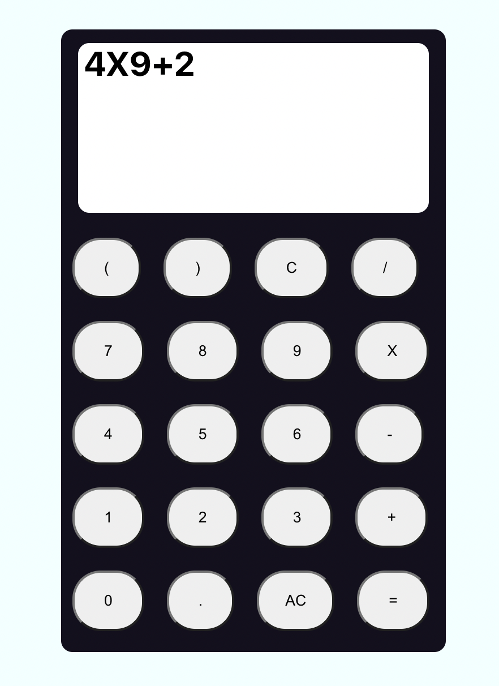

# Levi's React Calculator created for training during internship

Calculations involving parentheses are still incorrect.

Error handling is also unrefined because program will freeze if there is wrong syntax for the operator etc.

Forgive me, this was done in one day before moving on. I would say the fact that it works for simple calculation is something I will forever be proud of.